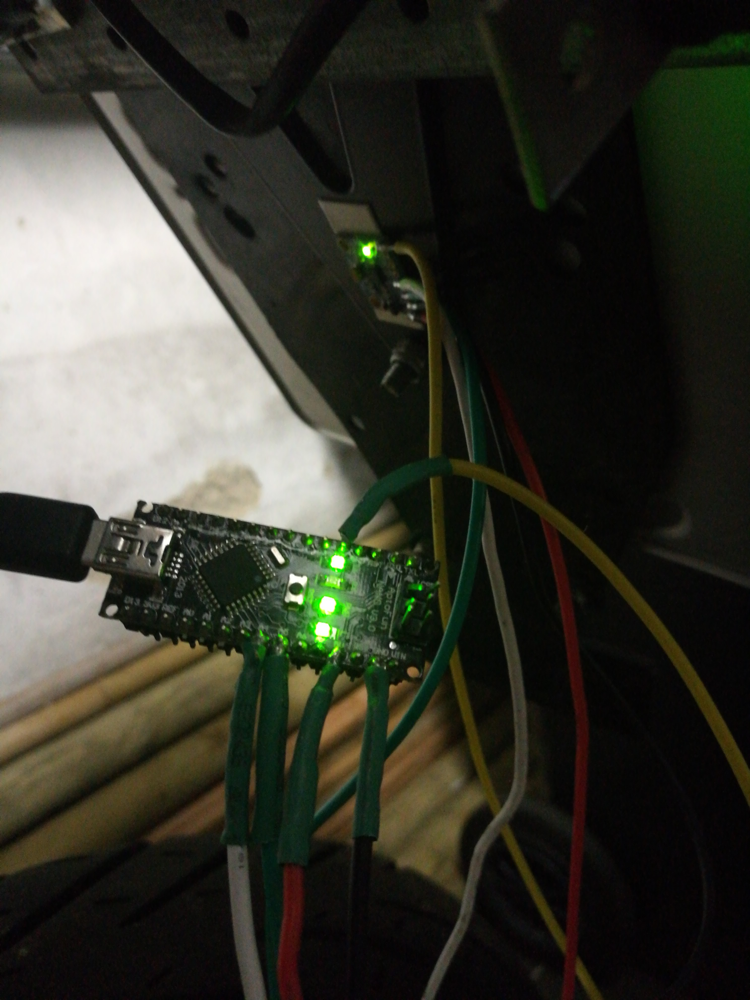
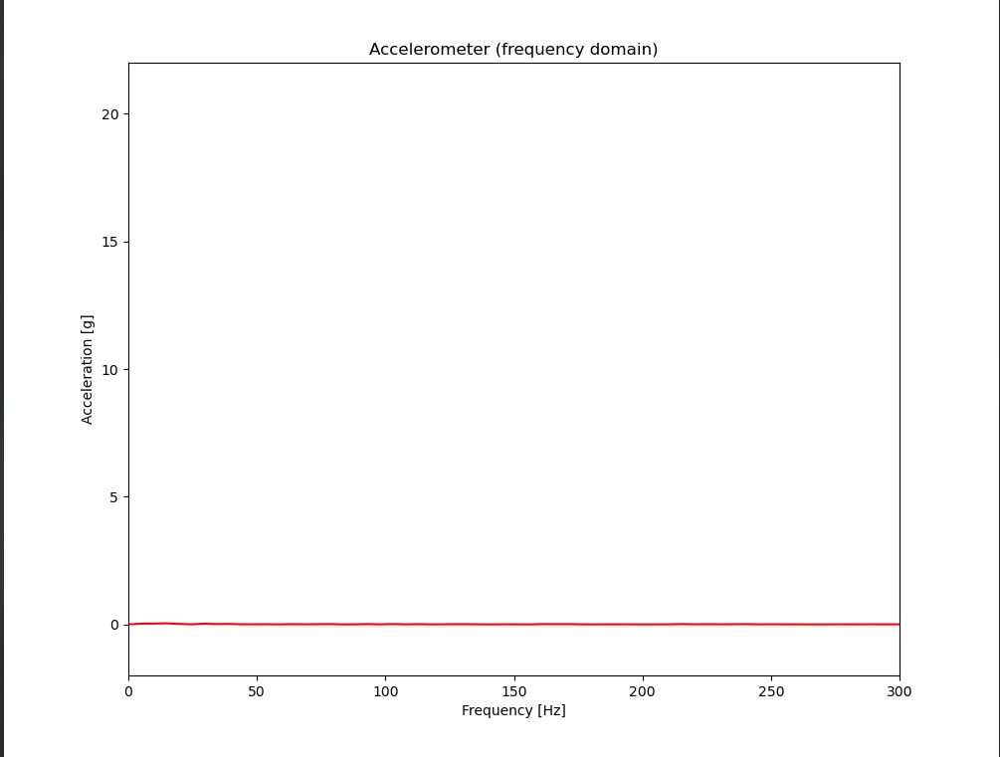
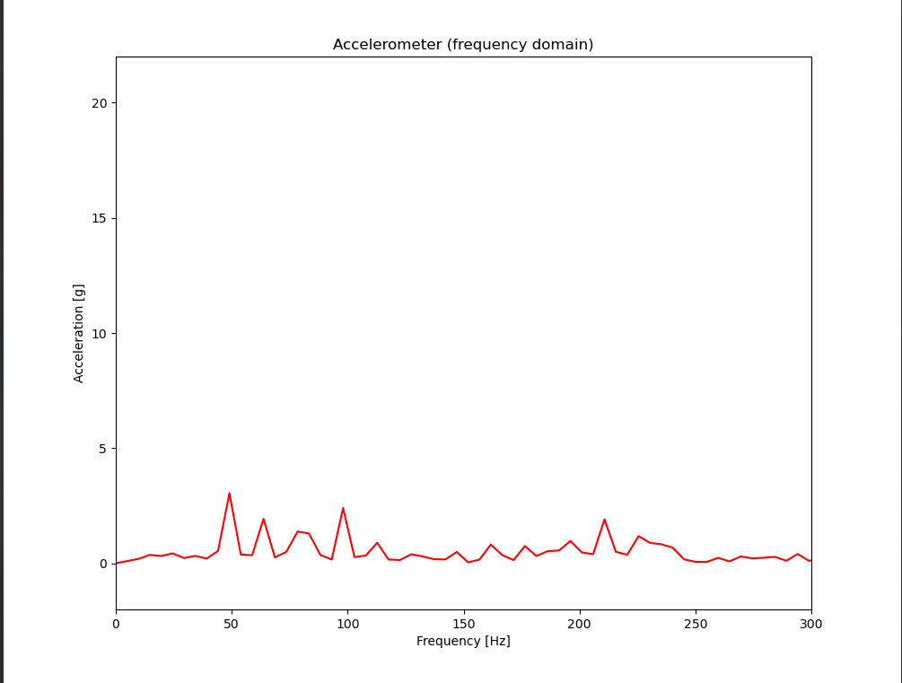

# freq-analyzer: An Acceleration Frequency Analyzer

This setup uses a MPU6050 as acceleration sensor which sends data to an Arduino
nano. The arduino forwards the data over USB to a laptop. On the laptop a
frequency analysis is done using the FFT function and the FFT is plotted in real
time. 

## Example: Motorcycle License Plate

The sensor was attached to a motorcycle license plate as can be seen in this
setup photo. The Arduino is shown in the foreground connected to the MPU6050 in
the background. 



The results of the frequency analysis are shown in the following 2 GIFs. In the
first GIF the license plate is excited by hand for short intervals. The plate is
just punched at at different locations. As can be clearly seen, there high
acceleration at about 50 Hz and several other frequencies show small peaks. This
leads to the assumption that the license plate on the motorcycle has a low
damped eigenfrequency at about 50 Hz. This eigenfrequency is also excited by the
engine as can be seen in the second GIF. Here the motorcycle is turned on and no
other excitation is used. The result is much more noisy as can be expected. But
the eigenfrequency at 50 Hz is clearly visible. Later in the GIF the throttle is
increased with slightly shifts peaks in the FFt. Knowing this, countermeasures
can be taken to reduce vibrations of the license plate. 





## Dependencies

### Arduino Interfacing and Libraries

Interfacing with the Arduino is done with the
[platformio](https://platformio.org/) library. The included Makefile can be used
to upload the code to the Arduino Nano by running 

```
make upload
```

The [i2cdev](https://www.i2cdevlib.com/) library is used to obtain data from the
MPU6050 IMU sensor.

### Python Modules

For the post processing the following important python modules are used:

| Python Module                         |
| -----------                           |
| [SciPy](https://www.scipy.org/)       |
| [Numpy](https://numpy.org/)           |
| [Matplotlib](https://matplotlib.org/) |

## Electrical Wiring

### MPU6050 Sensor to Arduino Nano

| MPU6050 Pin | Arduino Pin |
| ----------- | ----------- |
| 5V          | 5V          |
| GND         | GND         |
| SCL         | SCL         |
| INT         | INT0        |

### Arduino Nano to PC

The Arduino Nano is connected to the PC by a USB cable.
