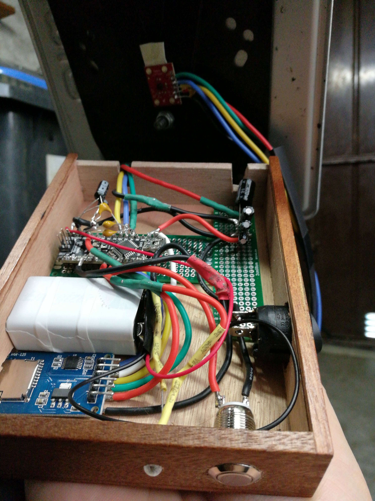
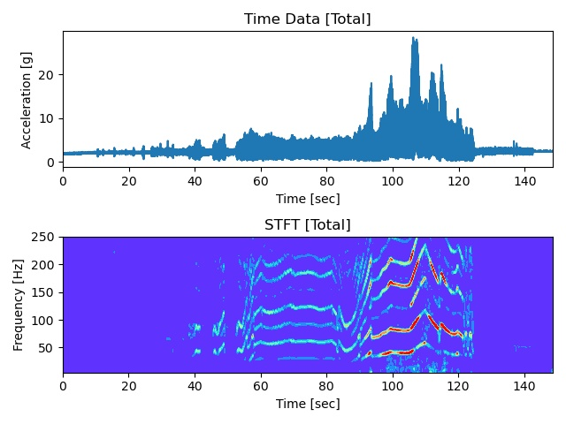

# freq-analyzer: An Acceleration Frequency Analyzer

This setup uses a Sparkfun ADXL377 as acceleration sensor which sends data to an Arduino
nano. The Arduino logs the data to an SD card in binary format. The data on the SD card can be
evaluated using python scripts. 

## Example: Motorcycle License Plate

The sensor was attached to a motorcycle license plate. Vibrations in the license
plate can lead to structural damage and should be mitigated. For this, first the
frequencies of the vibrations should be evaluated. The following picture shows
the setup of the system. In the background the accelerometer is mounted to the
back of the license plate. In the foreground, the system can be seen. 



The results of the frequency analysis are shown in the following figure. A short
ride with the motorcycle is recorded by the accelerometer. The above plot shows
the time series of the total acceleration and the below plot shows the short
time Fourier transform (STFT) up to 250 Hz. 
As can be seen in the STFT, there are several distinct frequencies at which the
license plate is excited. These often have harmonic dependencies between them.
The modulation of the frequencies correspond to changes in motor RPM. Higher
motor RPMs show higher frequencies as expected and also higher vibration
amplitudes.

Since the frequencies show a lot of modulation, a passive way to mitigate the
vibrations needs to cover a broad frequency range. Alternatively, active
measures can be taken to reduce the vibrations such as dynamic shakers. 



## Dependencies

### Arduino Interfacing and Libraries

Interfacing with the Arduino is done with the
[platformio](https://platformio.org/) library. The included Makefile can be used
to upload the code to the Arduino Nano by running 

```
make upload
```

The [SdFat](https://github.com/greiman/SdFat) library is used to log data to the
SD card in a very fast way using the AnalogBinLogger as an example. This
produces an binary file on the SD card but after the logging finished the
Arduino can convert this file to CSV.

### Python Modules

For the post processing the following important python modules are used:

| Python Module                         |
| -----------                           |
| [SciPy](https://www.scipy.org/)       |
| [Numpy](https://numpy.org/)           |
| [Matplotlib](https://matplotlib.org/) |

## Electrical Components 

The components used are: 

- [Arduino Nano](https://www.arduino.cc/en/Guide/ArduinoNano)
- [Sparkfun ADXL377](https://www.sparkfun.com/products/12803)
- [SD Card Breakout](https://www.amazon.com/Module-Storage-Adapter-Interface-Arduino/dp/B07PFDFPPC/ref=sr_1_1_sspa?dchild=1&keywords=arduino+breakout+sd+card&qid=1596090034&sr=8-1-spons&psc=1&spLa=ZW5jcnlwdGVkUXVhbGlmaWVyPUExVExaUkFCTTVPMUdPJmVuY3J5cHRlZElkPUEwNTI3OTQ1MzhSUVAzN1JDT1JKRSZlbmNyeXB0ZWRBZElkPUEwODEyODQ3MzdaQlNMU1hLNjZOTiZ3aWRnZXROYW1lPXNwX2F0ZiZhY3Rpb249Y2xpY2tSZWRpcmVjdCZkb05vdExvZ0NsaWNrPXRydWU=)
- Push Button
- LED
- 9V battery as power supply (many options available)

## Electrical Wiring

### Sparkfun ADXL377 Sensor to Arduino Nano

| ADXL377 Pin | Arduino Pin   |
| ----------- | -----------   |
| 3.3V        | 3.3V          |
| GND         | GND           |
| Z           | A1 (analog 1) |

Note that the sensor needs a capacitor from the analog output to ground as a low
pass filter. This capacitor can be chosen based on the desired bandwidth (see
datasheet).

### SD Card Breakout to Arduino Nano

| SD Card Breakout | Arduino Nano |
| -----------      | -----------  |
| 5V               | 5V           |
| GND              | GND          |
| MOSI             | MOSI (11)    |
| MISO             | MISO (12)    |
| SCK              | SCK (13)     |
| CS               | 10           |

### Arduino Nano to Battery

The Arduino Nano is powered through a 9V battery. Note that there is a switch
between the battery and the Arduino to be able to shut down the whole system.
This switch can be mounted anywhere in the power line.

| Arduino Nano | Battery     |
| -----------  | ----------- |
| Vin          | +           |
| GND          | -           |

### Decoupling Capacities

In order to have as little effect of voltage changes of the battery on the
accelerometer, it is advisable to use decoupling capacities. For further
information consult the datasheet of the ADXL377.

### Button and LED

For interaction with the system, there is a button with is mounted between GND
and digital pin 7. Additionally, a LED is mounted with the proper resistor
between GND and digital pin 5. The button is used to start and end the logging
process while the LED indicates logging activity. Do not turn off the power
while the LED is still on. The LED remains on after the button is pushed to turn
off logging since the binary log file is converted to CSV format which takes
some time especially for longer periods of logging.  
